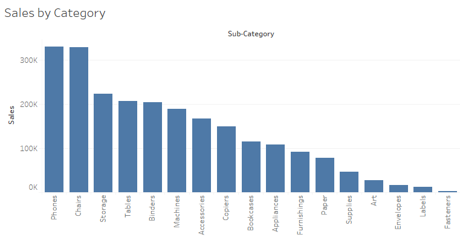
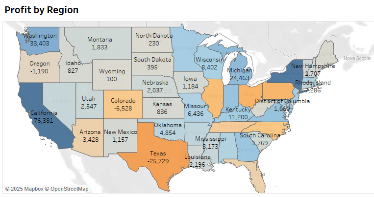

# Retail Sales Analytics Dashboard

🛍️ **Tableau Dashboard exploring product sales, profit margins, and customer segments for a retail store.**

---

## 📌 Overview

Analyzed the **Superstore** dataset using **Tableau**. Dashboard provides insights into category-wise sales, regional trends, and profit performance.

---

## ✅ Key Highlights

- Sales & profit by product category  
- Regional sales heat map  
- Top-performing sub-categories  
- Customer segments & trends

---

## 🛠️ Tools Used

- **Excel** — data preparation  
- **Tableau Desktop** — visualization

---

## 📈 Screenshots

| Category Sales | Regional Map |
|---|---|
|  |  |

---

## 📂 How to Use

Open `Retail-Analytics-Dashboard.twbx` in **Tableau Public** or Desktop.  
**Dataset:** [Sample Superstore](https://community.tableau.com/s/sample-superstore-data)

---

## 🔍 Insights

- Identified top categories driving profit.
- Uncovered underperforming segments.
- Provided recommendations for focus regions.

---

## 👤 Author

Aaryan  
[LinkedIn](https://linkedin.com/in/anarray) | [GitHub](https://github.com/An-Array)
